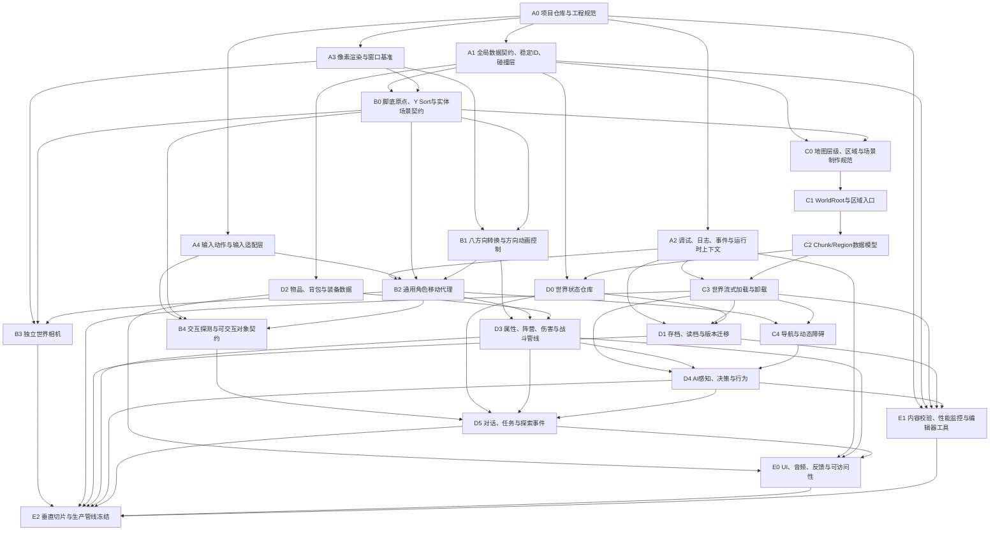

# Godot 八方向像素风 2D 俯视角开放世界 ARPG
## 基础设施依赖拓扑与项目实施计划

> 目标：以《困兽之国（Drova: Forsaken Kin）》式高角度俯视、八方向角色与探索驱动 ARPG 为视觉和交互参照，在 Godot 4.x / 4.7 中建立可持续扩展的开放世界项目底座。  
> 文档性质：工程实施计划、依赖拓扑、阶段验收标准。  
> 版本：V1.0  
> 日期：2026-07-22

---

# 1. 项目目标与第一版基准

本项目的第一目标不是立刻制作大地图、完整战斗或大量剧情，而是先建立一套不会在中后期被迫推倒重来的基础设施。

第一版垂直切片建议继承以下基准：

| 项目 | 第一版基准 |
|---|---:|
| 逻辑分辨率 | `640×360` |
| 画面比例 | `16:9` |
| 拉伸模式 | `viewport` |
| 缩放策略 | 整数缩放 |
| 纹理过滤 | Nearest |
| 相机 | 独立 `Camera2D`，不挂在玩家节点下 |
| 相机纵向构图偏移 | `-18 px` |
| 相机前视 | 约 `12×8 px` |
| 角色可见身体 | 约 `16×38 px` |
| 基础移动帧格 | `48×64 px` |
| 玩家走速 | `74 px/s` |
| 显示方向 | 8 方向 |
| 原型实际绘制方向 | 5 方向，镜像补齐 3 方向 |
| 待机动画 | 4 帧，6 FPS |
| 行走动画 | 6 帧，10 FPS |
| 脚底碰撞体 | 约 `12×8 px` |
| 世界排序基准 | 脚底接地点 |

这些数值是项目复刻规格，不应理解为原作源码参数。

---

# 2. 总体工程原则

## 2.1 单向依赖

高层玩法可以依赖底层服务，底层服务不能反向依赖具体玩法。

正确方向：

```text
任务系统 -> 世界状态接口 -> 稳定实体 ID
战斗系统 -> 角色属性接口 -> 通用事件/伤害数据
AI 系统 -> 移动代理/导航接口 -> 世界导航数据
```

错误方向：

```text
ChunkManager 直接引用 Player.gd 的具体实现
SaveManager 根据场景树路径硬编码查找每个宝箱
NPC 脚本直接修改任务 UI
武器脚本直接控制玩家 AnimationTree
```

## 2.2 一个职责只能有一个最终控制者

| 职责 | 唯一控制者 |
|---|---|
| 当前游戏状态 | `LimboHSM` 或统一状态机 |
| 当前方向动画 | `DirectionalAnimator` |
| 攻击有效帧 | `AnimationPlayer` 或帧事件系统 |
| 世界分块加载 | `WorldStreamer/ChunkManager` |
| 持久化写入 | `SaveManager` |
| 玩家输入解释 | `PlayerInputAdapter` |
| 世界时间推进 | `WorldClock` |

多个系统可以提出请求，但不能同时写同一个结果。

## 2.3 世界对象必须拥有稳定身份

开放世界中的以下对象不能只依靠场景路径识别：

- 宝箱；
- 门；
- 可采集物；
- 一次性敌人；
- NPC；
- 任务触发器；
- 场景机关；
- 掉落物；
- 区域入口。

它们必须拥有稳定的 `persistent_id`，否则分块卸载、重新加载和存档恢复后无法判断对象此前发生过什么。

## 2.4 “脚底点”是角色与场景的共同空间语义

所有参与 Y Sort 的对象都以地面接触点作为世界原点：

- 人物：两脚之间；
- 树木：树干根部；
- 桌子：桌腿接地中心；
- 房屋：门槛或指定遮挡基线；
- 道具：实际落地点。

视觉图片向上偏移，物理根节点留在地面接触点。

---

# 3. 基础设施总拓扑图

下面的图是项目的有向无环依赖图。箭头表示“前者必须先完成，后者才能可靠实施”。



---

# 4. 可执行的拓扑排序

同一序号中的任务可以并行；后一层必须等待所依赖的前置契约冻结。

| 拓扑层 | 基础设施 | 是否关键路径 |
|---:|---|---|
| 0 | A0 项目仓库与工程规范 | 是 |
| 1 | A1 全局数据契约；A2 调试/事件；A3 像素渲染；A4 输入适配 | 是 |
| 2 | B0 实体空间契约；D0 世界状态接口；D2 物品数据骨架 | 是 |
| 3 | B1 八方向动画；C0 地图制作规范 | 是 |
| 4 | B2 通用移动；C1 WorldRoot；B4 交互契约 | 是 |
| 5 | B3 世界相机；C2 Chunk/Region 数据模型 | 是 |
| 6 | C3 世界流式加载；D3 战斗数据管线 | 是 |
| 7 | C4 导航；D1 存档读档 | 是 |
| 8 | D4 AI；D5 对话任务与探索事件 | 是 |
| 9 | E0 UI/音频反馈；E1 工具、校验和性能监控 | 否，但必须在垂直切片前完成 |
| 10 | E2 垂直切片与生产管线冻结 | 最终门槛 |

## 4.1 最短关键路径

```text
A0 工程规范
→ A1 数据契约
→ B0 脚底原点与实体契约
→ C0 地图层级规范
→ C1 WorldRoot
→ C2 Chunk 数据模型
→ C3 流式加载
→ D1 存档恢复
→ D4 AI
→ D5 探索事件
→ E2 垂直切片
```

角色体验关键路径：

```text
A3 像素渲染
→ B0 脚底原点
→ B1 八方向动画
→ B2 移动代理
→ B3 世界相机
→ D3 战斗
→ E2 垂直切片
```

---

# 5. 各基础设施详细实施计划

# A0 项目仓库与工程规范

## 目标

建立所有后续模块共同遵循的工程边界。

## 工作项

- 初始化 Git 仓库；
- 建立 `.gitignore`；
- 明确 Godot 主版本；
- 固定插件版本；
- 建立代码格式化和命名规范；
- 规定资源路径、场景命名、脚本命名；
- 区分源美术与运行时资源；
- 建立 `main/dev/feature/*` 分支策略；
- 建立最小可运行启动场景。

## 推荐目录

```text
res://
├── app/
│   ├── boot/
│   ├── runtime/
│   └── autoload/
├── actors/
│   ├── shared/
│   ├── player/
│   ├── npc/
│   └── enemies/
├── world/
│   ├── root/
│   ├── regions/
│   ├── chunks/
│   ├── navigation/
│   └── streaming/
├── gameplay/
│   ├── interaction/
│   ├── combat/
│   ├── items/
│   ├── quests/
│   └── dialogue/
├── data/
│   ├── definitions/
│   ├── databases/
│   └── schemas/
├── ui/
├── audio/
├── fx/
├── tools/
├── tests/
└── debug/

art_source/
├── actors/
├── environment/
└── ui/
```

## 完成标准

- 新成员能在不询问路径规则的情况下创建一个 NPC 场景；
- 所有插件和工程设置均可由仓库复现；
- 项目启动后进入灰盒测试场景；
- 不存在“临时资源散落在根目录”的情况。

---

# A1 全局数据契约、稳定 ID 与碰撞层

## 目标

在开始制作具体玩法前，冻结所有系统共享的最小协议。

## 必须定义

### 1. 稳定身份

```text
persistent_id: StringName
definition_id: StringName
runtime_id: int
```

- `persistent_id`：某个世界实例的永久身份；
- `definition_id`：对象使用哪一份配置；
- `runtime_id`：本次运行中的临时句柄。

### 2. 通用接口

建议以基类、组合组件或 Duck Typing 约定实现：

```text
Persistable
Interactable
Damageable
FactionMember
WorldStateConsumer
ChunkResident
NavigationAgentOwner
```

### 3. 碰撞层与遮罩

必须在开始堆场景前统一编号，例如：

```text
1  WorldSolid
2  ActorBody
3  PlayerHurtbox
4  EnemyHurtbox
5  PlayerHitbox
6  EnemyHitbox
7  Interactable
8  InteractionProbe
9  Trigger
10 Projectile
11 NavigationObstacle
12 Pickup
```

编号可调整，但一旦进入内容制作，不应随意重排。

### 4. 全局枚举/标签

```text
Direction8
FactionId
DamageType
InteractionType
SaveScope
WorldLayer
ActorStateTag
```

## 完成标准

- 任意世界对象可以被唯一识别；
- 重新加载区块时不会生成重复永久 ID；
- 角色、攻击、交互和触发器的碰撞层不会互相污染；
- 所有系统通过接口访问，不根据具体脚本路径强转。

---

# A2 调试、日志、事件与运行时上下文

## 目标

让后续开放世界问题可观察、可定位、可复现。

## 建议模块

```text
GameRuntime
EventBus
DebugOverlay
LogService
PerformanceProbe
CommandConsole
```

## 最小调试信息

- 玩家世界坐标；
- 当前区块坐标；
- 已加载区块数量；
- 当前朝向和移动向量；
- 当前 HSM 状态；
- 当前交互目标；
- 实体数量；
- 导航代理数量；
- 帧时间与物理帧时间；
- 最近一次保存时间；
- 当前世界状态键数量。

## 事件规则

事件总线只承载跨系统通知，不应替代直接函数调用。

适合事件：

```text
actor_died
item_acquired
quest_state_changed
chunk_loaded
chunk_unloaded
world_flag_changed
save_completed
```

不适合事件：

```text
每一帧移动输入
每一次 velocity 更新
角色内部动画状态切换
```

## 完成标准

- 能通过调试层确认区块加载边界；
- 能查看某个永久实体的当前状态；
- 关键错误有上下文日志，不只是空引用报错；
- 可在游戏内执行传送、重载区块、保存、读档等调试命令。

---

# A3 像素渲染与窗口基准

## 目标

在制作正式资源前冻结画面采样和显示规则。

## 配置

```text
Viewport Width: 640
Viewport Height: 360
Stretch Mode: viewport
Stretch Aspect: expand（开放世界默认）
Scale Mode: integer
Texture Filter: Nearest
Texture Repeat: Disabled
PNG Compression: Lossless
Mipmaps: Off
Camera Zoom: Vector2.ONE
```

优先测试：

```text
rendering/2d/snap/snap_2d_transforms_to_pixel = true
```

不要在未测试前同时启用 transforms 与 vertices 两种像素吸附。

## 必做测试矩阵

| 输出环境 | 检查项 |
|---|---|
| 1280×720 | 2× 整数缩放 |
| 1920×1080 | 3× 整数缩放 |
| 2560×1440 | 4× 整数缩放 |
| 16:10 | `expand` 后可视范围 |
| 21:9 | 横向额外视野和相机限制 |
| 无边框窗口 | 切换后逻辑分辨率不改变 |
| 真全屏 | Alt+Tab 与显示器切换稳定 |

## 完成标准

- 静止和移动时无纹理模糊；
- 角色与地图使用一致的像素对齐策略；
- 分辨率切换不会改变游戏世界坐标；
- UI 与世界画面缩放规则分离。

---

# A4 输入动作与输入适配层

## 目标

把“硬件输入”转换为“游戏意图”，避免玩家脚本直接读取大量按键。

## 输入动作

```text
move_left
move_right
move_up
move_down
interact
attack_light
attack_heavy
dodge
block
lock_target
inventory
map
pause
```

## 输入适配输出

```text
move_vector
aim_vector
interact_pressed
attack_request
dodge_request
menu_request
```

使用 `Input.get_vector()` 保证斜向速度不会增加到约 1.414 倍。

## 完成标准

- 键鼠和手柄可输出相同意图；
- 输入死区在适配层统一处理；
- 游戏暂停、UI 打开和对话期间可切换 Input Context；
- Player、UI、Debug Console 不会同时消费同一次输入。

---

# B0 脚底原点、Y Sort 与实体场景契约

## 目标

建立所有角色、NPC、敌人和场景遮挡物共同遵循的空间标准。

## 玩家原型场景

```text
Player (CharacterBody2D)  # 世界原点=脚底
├── VisualRoot (Node2D)
│   ├── Shadow (Sprite2D)
│   └── Body (AnimatedSprite2D)
├── CollisionShape2D
├── InteractionArea (Area2D)
│   └── CollisionShape2D
├── Hurtbox (Area2D)
│   └── CollisionShape2D
├── DirectionalAnimator (Node)
└── CameraTarget (Marker2D)
```

## 世界排序结构

```text
WorldRoot
├── GroundLayers
├── StaticBackLayers
├── YSortedEntities        # y_sort_enabled = true
│   ├── Player
│   ├── NPC
│   ├── Enemy
│   ├── TreeTrunk
│   └── Prop
├── AboveLayers
├── RoofAndCanopy
└── WorldFX
```

## 规则

- `CharacterBody2D.global_position` 表示脚底；
- `AnimatedSprite2D` 向上偏移；
- 碰撞体只覆盖脚底附近；
- 影子始终位于身体下方，不以身体中心参与世界排序；
- 树冠和屋顶不能简单与树干使用同一个排序点；
- 大型物体需要拆成“底座/遮挡层/顶部层”。

## 完成标准

测试场景至少包含：

- 树；
- 墙；
- 门；
- 桌子；
- 屋檐；
- 狭窄通道；
- 两个互相穿行的角色。

验收结果：角色前后穿行时遮挡正确，肩膀不会因碰撞体过大卡住。

---

# B1 八方向转换与方向动画控制

## 目标

让所有角色共享统一的方向命名、方向判定和动画入口。

## 方向命名

```text
n, ne, e, se, s, sw, w, nw
```

## 状态与方向命名

```text
idle_n
walk_ne
run_e
roll_sw
hurt_s
attack_light_1_nw
```

## 职责分离

```text
LimboHSM              决定角色处于什么状态
DirectionalAnimator   决定播放哪个方向动画
AnimationPlayer       触发攻击、脚步、无敌帧等精确事件
```

## 原型美术范围

```text
实际绘制方向：n, ne, e, se, s
镜像方向：nw, w, sw
待机：5 × 4 = 20 帧
行走：5 × 6 = 30 帧
合计：50 帧
```

主角正式制作时补齐完整八方向，避免左右手装备被镜像交换。

## 完成标准

- 8 个显示方向切换正确；
- 停止移动后保留最后朝向；
- 移动方向与瞄准/面对方向可以分离；
- 攻击期间移动系统不能覆盖攻击动画；
- 镜像方向脚底锚点不漂移。

---

# B2 通用角色移动代理

## 目标

让玩家、NPC 和敌人共享同一套物理移动语义，但由不同控制器提供意图。

## 推荐分层

```text
PlayerInputController  ┐
AIController           ├─> ActorMotor -> CharacterBody2D
ScriptedController     ┘
```

`ActorMotor` 只关心：

- 期望移动方向；
- 最大速度；
- 加速/减速；
- 外力；
- 地形速度修正；
- 是否允许移动；
- `move_and_slide()`；
- 实际速度反馈。

它不关心：

- 按键；
- AI 决策；
- 任务；
- 动画资源名；
- UI。

## 第一版参数

```text
walk_speed = 74 px/s
run_speed = 108 px/s
```

动画播放倍率：

```text
speed_scale = clamp(actual_speed / base_walk_speed, 0.75, 1.35)
```

## 完成标准

- 直线与斜向实际速度一致；
- 低速时动画不完全停止；
- 碰撞滑动稳定；
- 移动模块可被玩家和 AI 同时复用；
- 受击、攻击、翻滚可以临时获得移动控制权。

---

# B3 独立世界相机

## 目标

实现像素稳定、可限制、可切换目标、可处理传送的世界镜头。

## 节点结构

```text
WorldRoot
├── Player
└── WorldCamera (Camera2D)
```

不把相机作为玩家子节点，原因：

- 可独立平滑；
- 可在玩家死亡、过场和地图观察时更换目标；
- 可设置区域限制；
- 可在传送后立即吸附；
- 不会继承玩家旋转、缩放或抖动。

## 第一版参数

```text
composition_offset = Vector2(0, -18)
look_ahead_distance = Vector2(12, 8)
follow_rate = 8～12
look_ahead_rate = 6～9
```

前视优先级：

```text
锁定目标方向
> 瞄准方向
> 移动方向
> Vector2.ZERO
```

## 必须支持

- `set_target()`；
- `snap_to_target()`；
- `set_limits()`；
- `clear_limits()`；
- `set_look_direction()`；
- 战斗锁定时降低前视；
- 室内区域关闭或缩小前视；
- 屏幕震动只影响视觉，不改变世界逻辑坐标。

## 完成标准

- 玩家默认显示在屏幕中心略偏下；
- 镜头停止时无亚像素抖动；
- 瞬移或读档后镜头不会慢慢追赶；
- 宽屏不会看到地图外区域；
- 相机震动不会破坏像素采样。

---

# B4 交互探测与可交互对象契约

## 目标

为探索驱动玩法建立统一的“发现—选择—执行—反馈”链路。

## 交互链路

```text
InteractionProbe
→ 候选对象过滤
→ 方向/距离/优先级评分
→ 当前交互目标
→ Interactable.interact(context)
→ 结果事件/提示
```

## Interactable 最小信息

```text
interaction_id
interaction_type
prompt_text
priority
enabled
persistent_id（需要持久化时）
```

## 第一版对象

- 宝箱；
- 门；
- NPC；
- 采集点；
- 调查点；
- 区域出口；
- 地面拾取物。

## 完成标准

- 重叠多个对象时只选择一个明确目标；
- 目标切换不会闪烁；
- UI 只显示交互系统选中的目标；
- 已开启宝箱重新加载区块后仍保持开启；
- 交互期间可以锁定移动或朝向。

---

# C0 地图层级、区域与场景制作规范

## 目标

冻结地图作者使用的图层语义，使 Chunk、导航、Y Sort 和存档可以自动处理场景。

## 建议地图层级

```text
Region_xxx
├── Ground
├── GroundDetail
├── StaticBack
├── Collision
├── YSortBases
├── AbovePlayer
├── RoofAndCanopy
├── Navigation
├── Occluders
├── Triggers
├── SpawnPoints
├── PersistentEntities
├── AmbientZones
└── DebugMarkers
```

## 关键决策门

在大量地图制作前必须冻结：

1. Tile 单元尺寸；
2. Chunk 的世界尺寸；
3. Region 与 Chunk 的关系；
4. 地图边界表达方式；
5. 屋顶/树冠隐藏方式；
6. 导航数据按区块还是按区域生成；
7. 静态碰撞是否按区块合并；
8. 持久化对象的 ID 生成规则。

### Tile 尺寸建议

原分析没有给出地块单元尺寸，因此不要直接把 Tile 尺寸当作原作参数。第一轮灰盒应比较：

```text
16×16 逻辑像素
32×32 逻辑像素
```

选择标准：

- 是否适合 38 px 高人物；
- 窄路和门宽是否自然；
- 地形拼接工作量；
- 碰撞轮廓复杂度；
- 单个区块资源量；
- 美术是否能稳定生产。

## 完成标准

- 地图作者只需遵守固定图层即可接入世界系统；
- ChunkManager 不依赖具体美术节点名称以外的临时结构；
- 屋顶、树冠、碰撞和 Y Sort 语义明确；
- 所有永久对象可通过工具检查重复 ID。

---

# C1 WorldRoot 与区域入口

## 目标

建立游戏世界的最高层编排节点，但不把所有功能塞进一个巨型脚本。

## 推荐结构

```text
WorldRoot
├── WorldCamera
├── LoadedChunks
├── PersistentEntities
├── TransientEntities
├── PlayerSpawnRoot
├── NavigationRoot
├── WorldFX
├── WorldAudio
├── WorldStreamer
├── WorldStateBridge
└── RegionController
```

## WorldRoot 只负责

- 初始化世界运行环境；
- 装配依赖；
- 接收区域切换；
- 管理玩家进入/离开世界；
- 连接相机、流式加载和世界状态。

## WorldRoot 不负责

- 具体敌人 AI；
- 每个任务逻辑；
- 物品计算；
- 伤害公式；
- UI 页面；
- 每个 Chunk 内的对象行为。

## 完成标准

- 可从 Boot 场景加载指定 Region；
- 玩家出生点由稳定 ID 定位；
- 区域重载后系统依赖重新连接；
- WorldRoot 脚本保持编排器而非“上帝类”。

---

# C2 Chunk / Region 数据模型

## 目标

先定义数据模型，再写加载算法。

## RegionDefinition

```text
region_id
scene_or_manifest
world_bounds
chunk_size
entry_points
camera_limits
ambient_profile
music_profile
save_scope
```

## ChunkDefinition

```text
chunk_id
region_id
grid_coordinate
world_bounds
scene_path
neighbor_ids
navigation_resource
estimated_cost
preload_tags
```

## Chunk 运行状态

```text
Unloaded
Queued
Loading
LoadedInactive
Active
Unloading
Failed
```

## ChunkResident 契约

区块中的运行时对象应声明：

```text
所属 chunk_id
是否可跨区块迁移
卸载时是销毁、迁移还是序列化
是否拥有 persistent_id
```

## 完成标准

- 任意世界坐标可以确定所属 Chunk；
- 区块边界不会依赖玩家脚本；
- 邻接关系可由数据或坐标推导；
- 运行时可查询一个实体属于哪个区块；
- 跨区块对象有明确所有权策略。

---

# C3 世界流式加载与卸载

## 目标

实现“玩家移动时无感加载附近世界，远处世界安全卸载”。

## 第一版加载策略

采用距离分层，而不是只加载玩家所在一个区块。

```text
Active Ring：玩家所在区块及直接邻近区块
Warm Ring：外一圈，已实例化但可降低更新频率
Unloaded：更远区块
```

实际半径必须通过压力测试决定，不要过早写死。

## 加载流程

```text
玩家/相机位置变化
→ 计算目标区块集合
→ 与当前集合做差
→ 排队加载新 Chunk
→ 注入世界状态
→ 激活导航/实体/触发器
→ 延迟卸载离开的 Chunk
→ 捕获迁移实体和状态
→ 释放资源
```

## 必须解决的问题

- 快速跑动导致的加载抖动；
- 反复跨边界导致加载/卸载乒乓；
- 玩家站在边界处时的相邻区块可见性；
- 敌人追击跨区块；
- 投射物跨区块；
- 导航连接；
- 背景音区切换；
- 区块卸载前的状态捕获；
- 读档时先加载落点区块再生成玩家。

## 防抖策略

- 加载半径小于卸载半径；
- Chunk 离开范围后延迟数秒再卸载；
- 同时加载数量设上限；
- 按玩家运动方向提高前方区块优先级；
- 传送时使用专门的批量切换流程。

## 完成标准

- 连续穿越多个区块无明显卡顿；
- 边界附近不会频繁反复实例化；
- 已改变对象在重新加载后恢复正确；
- 敌人跨边界不会被错误销毁；
- 可通过调试层看到加载队列和状态机。

---

# C4 导航与动态障碍

## 目标

让 AI 在分块世界中稳定寻路，而不依赖完整世界常驻内存。

## 第一版策略

- 每个 Chunk 或 Region 提供可组合导航数据；
- 加载区块时注册导航；
- 卸载区块前移除导航；
- 门、推箱和大型移动实体使用动态障碍；
- AI 只对已加载且可达区域发起寻路；
- 远距离跨区域移动使用高层路线或直接模拟，不做全世界实时寻路。

## 导航分层

```text
高层：Region/Chunk 邻接图
低层：NavigationServer2D 路径
局部：避障和角色间分离
```

## 完成标准

- 敌人可跨相邻 Chunk 追击；
- 关闭的门会改变可达性；
- 区块卸载后不存在失效导航引用；
- 大量 NPC 不会每帧重复请求完整路径；
- 卡住时有重新寻路和失败降级策略。

---

# D0 世界状态仓库

## 目标

把“世界发生过什么”从具体场景节点中抽离。

## 状态示例

```text
chest.bandit_camp.001.opened = true
door.old_mine.entrance.unlocked = true
npc.village.blacksmith.alive = true
resource.herb.field_03.next_respawn = 123456
quest.main_001.stage = 4
region.swamp.discovered = true
```

## 状态层级

```text
GlobalState   跨存档或账号级设置
WorldState    当前游戏世界的永久变化
RegionState   某区域变化
ChunkState    区块内对象变化
SessionState  本次运行临时状态
```

## 规则

- 场景实例是世界状态的表现，不是唯一真相；
- Chunk 加载后从状态仓库恢复；
- Chunk 卸载前将必要变化写回；
- 不持久化可重新推导的数据；
- 不直接保存整个场景树。

## 完成标准

- 打开宝箱后卸载区块，再加载仍保持开启；
- NPC 死亡后不会因切区块复活；
- 临时粒子、寻路缓存、动画帧不会进入存档；
- 状态键可在调试面板查看和修改。

---

# D1 存档、读档与版本迁移

## 目标

建立支持开放世界状态、玩家状态和未来版本升级的可靠存档。

## 存档内容

```text
save_version
build_version
timestamp
play_time
current_region_id
player_transform
player_stats
inventory
equipment
quests
world_state
settings_override（可选）
```

## 读档顺序

```text
读取并校验文件
→ 迁移旧版本数据
→ 初始化全局数据库
→ 加载目标 Region
→ 加载落点 Chunk 集合
→ 恢复世界状态
→ 生成/恢复玩家
→ 恢复任务和 UI
→ 相机 snap_to_target
→ 解除输入锁定
```

## 安全策略

- 临时文件写入后原子替换；
- 保留自动备份；
- 保存时写入校验信息；
- 存档失败不得覆盖旧档；
- `save_version` 与游戏版本分开；
- 每次结构变化提供迁移函数；
- 保存过程中冻结关键世界写操作或制作一致性快照。

## 完成标准

- 在区块边界、战斗后、宝箱开启后均能正确保存；
- 旧版测试存档可通过迁移读取；
- 损坏的主存档可以回退备份；
- 读档后镜头、任务、NPC 和世界对象状态一致；
- 不依赖节点路径恢复永久对象。

---

# D2 物品、背包与装备数据

## 目标

建立数据驱动的物品定义，不把物品属性写死在 UI 或场景脚本中。

## ItemDefinition

```text
item_id
name_key
description_key
icon
category
stack_limit
weight
value
tags
use_effects
equip_slot
world_scene
```

## 实例与定义分离

```text
ItemDefinition：所有同类铁剑共享的静态数据
ItemInstance：耐久、词缀、绑定状态等个体数据
```

## 完成标准

- 世界拾取物、背包格子和装备栏引用同一个定义；
- UI 不直接决定物品效果；
- 物品 ID 可安全进入存档；
- 装备变更通过角色属性/外观接口生效；
- 删除或重命名物品时有数据迁移策略。

---

# D3 属性、阵营、伤害与战斗管线

## 目标

先建立战斗数据流，再制作大量攻击动作。

## 依赖链

```text
输入/AI 请求
→ HSM 进入攻击状态
→ DirectionalAnimator 锁定方向
→ AnimationPlayer 到达事件帧
→ Hitbox 激活
→ Hurtbox 接收
→ DamageResolver 结算
→ 属性变化/受击反馈/死亡
→ 世界状态与任务事件
```

## 基础模块

```text
StatsComponent
HealthComponent
FactionComponent
Hurtbox
Hitbox
DamageRequest
DamageResult
StatusEffectContainer
CombatTargeting
```

## 关键规则

- Hitbox 不直接修改生命值；
- DamageResolver 返回完整结算结果；
- 阵营过滤与物理碰撞分离；
- 动画帧事件决定攻击生效窗口；
- 攻击状态锁定方向或按设计开放转向；
- 受击、死亡、格挡、闪避由状态机仲裁。

## 第一版范围

- 一段轻攻击；
- 一个敌人近战攻击；
- 受击；
- 死亡；
- 短暂无敌翻滚；
- 最小锁定/软目标选择；
- 不做复杂连招树、元素反应和大量状态效果。

## 完成标准

- 攻击只在指定帧命中；
- 同一次挥砍不会重复命中同一目标；
- 玩家和敌人使用同一伤害管线；
- 攻击方向不会被移动动画覆盖；
- 死亡结果可被任务和世界状态监听。

---

# D4 AI 感知、决策与行为

## 目标

以 LimboAI/HSM/BT 构建可复用 AI，而不是每个敌人写一个巨型脚本。

## AI 分层

```text
Perception       发现目标、声音、受击来源
Blackboard       共享当前目标、最后位置、警戒值
Decision         BT 或 HSM 选择行为
Action           移动、攻击、等待、巡逻、逃跑
ActorMotor       执行实际移动
CombatComponent  执行战斗请求
```

## 第一版敌人状态

```text
Idle
Patrol
Investigate
Chase
Attack
Hurt
ReturnHome
Death
```

## 开放世界约束

- 远离玩家的 AI 降低 Tick 频率；
- Warm Ring 中 AI 可以低频模拟；
- 未加载区块中的 AI 不运行完整行为树；
- 敌人跨区块前确认目标区块已加载；
- 超出活动范围后回归或转为世界模拟状态；
- 每个 AI 有 home_chunk/home_position。

## 完成标准

- 一个敌人可巡逻、发现、追击、攻击、丢失目标并返回；
- 跨 Chunk 追击不丢失引用；
- 区块卸载时 AI 状态能安全收束；
- 20～50 个测试 AI 不产生明显尖峰；
- 行为树不直接控制 AnimatedSprite2D。

---

# D5 对话、任务与探索事件

## 目标

让探索、交互、战斗和世界变化通过数据驱动的条件/动作系统组合。

## 通用条件

```text
HasItem
QuestStageEquals
WorldFlagEquals
ActorAlive
RegionDiscovered
StatThreshold
TimeRange
```

## 通用动作

```text
SetWorldFlag
AdvanceQuest
GiveItem
RemoveItem
OpenDoor
SpawnActor
DespawnActor
StartDialogue
PlaySequence
RevealMapMarker
```

## 任务状态

```text
Inactive
Active
Completed
Failed
```

复杂任务使用阶段：

```text
quest_id + stage + objective states
```

## 规则

- 任务不直接依赖某个场景节点；
- 通过永久 ID、世界状态和事件监听目标；
- 任务 UI 只是任务状态的观察者；
- 对话选项修改世界状态，由其他系统响应；
- 区块未加载时，任务状态仍可变化。

## 第一版探索闭环

```text
发现营地
→ 与 NPC 对话
→ 接受调查任务
→ 穿越两个 Chunk
→ 调查一个持久化交互点
→ 击败目标敌人
→ 世界标记变化
→ 返回对话
→ 获得物品奖励
```

## 完成标准

- 任务可跨区块进行；
- 保存/读档后阶段与目标一致；
- 目标实体未加载时不会报错；
- NPC 死亡或条件变化时任务有降级路径；
- UI 与具体任务脚本解耦。

---

# E0 UI、音频、反馈与可访问性

## 目标

把信息反馈接入已有事件和数据，而不是反向驱动世界逻辑。

## 第一版 UI

- 生命；
- 体力；
- 当前交互提示；
- 简单背包；
- 装备槽；
- 任务追踪；
- 暂停菜单；
- 地图/已探索区域；
- 调试信息开关。

## 音频

```text
AudioManager
├── Music Bus
├── Ambience Bus
├── SFX Bus
├── UI Bus
└── Voice Bus（预留）
```

脚步事件建议在行走帧 `0` 和 `3` 触发，并根据地表材质选择声音。

## 可访问性预留

- 字体缩放；
- 屏幕震动强度；
- 闪烁效果开关；
- 键位重映射；
- 手柄死区；
- 长按/切换模式；
- 色彩不作为唯一状态信息。

## 完成标准

- UI 不直接操作 Chunk 或 NPC 节点；
- 暂停后世界逻辑和 UI 动画按设计运行；
- 音频区与区块加载协同；
- 分辨率变化后 UI 保持清晰和安全边距。

---

# E1 内容校验、性能监控与编辑器工具

## 目标

在内容规模扩大前，把重复人工检查变成工具。

## 必做校验器

- 重复 `persistent_id`；
- 缺失 `definition_id`；
- Chunk 越界实体；
- 未注册碰撞层；
- 缺失方向动画；
- Sprite 帧数/FPS 不一致；
- 脚底锚点不一致；
- 任务引用不存在的 ID；
- 地图入口指向不存在的 Region/Spawn；
- 存档定义版本不匹配。

## 性能预算

至少记录：

```text
Loaded Chunk 数量
Node 数量
CanvasItem 数量
活动 AI 数量
NavigationAgent 数量
Physics Body/Area 数量
脚本帧耗时
物理帧耗时
加载峰值
显存与内存趋势
```

## 推荐调试命令

```text
teleport <spawn_id>
load_chunk <chunk_id>
unload_chunk <chunk_id>
reload_chunk
save <slot>
load <slot>
set_flag <key> <value>
spawn <definition_id>
kill_all_enemies
show_nav
show_chunk_bounds
```

## 完成标准

- CI 或编辑器工具能在提交前发现重复 ID；
- 可视化 Chunk 边界、导航和 Y Sort 原点；
- 性能问题可定位到具体区块或实体类型；
- 内容作者不需要手动检查几十项规则。

---

# E2 垂直切片与生产管线冻结

## 目标

用一个小而完整的开放世界区域验证所有基础设施，而不是用孤立测试场景宣布系统完成。

## 建议垂直切片内容

### 世界

- 1 个 Region；
- 3×3 或相近规模的测试 Chunk；
- 林地、道路、小营地、建筑室内；
- 至少一个屋顶/树冠遮挡场景；
- 两个跨 Chunk 入口。

### 角色

- 主角五方向原型动画，显示八方向；
- 1 个友好 NPC；
- 1 种近战敌人；
- 1 种可交互对象；
- 1 个持久化宝箱；
- 1 扇可开关门。

### 玩法

- 移动；
- 交互；
- 一段轻攻击；
- 翻滚；
- 敌人巡逻与追击；
- 一条跨区块小任务；
- 拾取、背包和装备；
- 保存和读档。

### 技术验证

- 连续跨越区块；
- 快速传送；
- 区块卸载后恢复宝箱/敌人/门状态；
- AI 跨区块追击；
- 720p、1080p、1440p；
- 窗口、无边框、全屏切换；
- 30 分钟持续运行无明显内存增长。

## 冻结标准

只有以下条件全部满足，才进入大规模内容生产：

- [ ] 像素显示规则稳定；
- [ ] Tile 与 Chunk 尺寸冻结；
- [ ] 玩家场景契约冻结；
- [ ] 地图图层规范冻结；
- [ ] 永久 ID 工具可用；
- [ ] Chunk 加载/卸载无明显卡顿；
- [ ] 存档可恢复跨区块世界状态；
- [ ] 战斗和 AI 使用通用接口；
- [ ] 任务不依赖场景节点路径；
- [ ] 性能监控与校验工具可用；
- [ ] 至少完成一次旧存档迁移演练。

---

# 6. 分阶段排期建议

时间只表示相对工作量，不作为固定承诺。单人开发应优先按“验收门槛”推进，而不是追求日历完成率。

## 阶段 0：工程冻结

```text
A0 + A1 + A2 + A3 + A4
```

交付：

- 工程目录；
- 像素渲染设置；
- 输入动作；
- 碰撞层；
- 稳定 ID 规范；
- 调试覆盖层。

禁止提前：

- 大量正式地图；
- 大量装备和物品；
- 复杂任务；
- 完整主角动作集。

## 阶段 1：角色与画面灰盒

```text
B0 + B1 + B2 + B3
```

交付：

- 38 px 占位角色；
- 脚底原点；
- Y Sort 测试场景；
- 八方向移动；
- 五方向待机/行走原型；
- 独立相机。

## 阶段 2：探索交互闭环

```text
B4 + C0 + C1
```

交付：

- 地图图层规范；
- WorldRoot；
- 门、宝箱、NPC、调查点；
- 交互提示。

## 阶段 3：开放世界流式底座

```text
C2 + C3 + C4 + D0
```

交付：

- Chunk 数据；
- 加载/卸载状态机；
- 防抖策略；
- 导航拼接；
- 世界状态仓库。

## 阶段 4：存档与战斗

```text
D1 + D2 + D3
```

交付：

- 可靠保存与读档；
- 物品/背包；
- 一套玩家与敌人共用的伤害管线；
- 一段攻击、受击、死亡和翻滚。

## 阶段 5：AI 与探索内容

```text
D4 + D5
```

交付：

- 巡逻、感知、追击、攻击、返回；
- 对话；
- 一条跨区块任务；
- 世界状态驱动的对象变化。

## 阶段 6：整合与生产冻结

```text
E0 + E1 + E2
```

交付：

- UI/音频；
- 编辑器校验；
- 性能预算；
- 可保存、可战斗、可探索的垂直切片；
- 正式内容生产手册。

---

# 7. 可并行开展的工作流

## 7.1 美术工作流

在以下规格冻结后即可并行：

```text
逻辑分辨率
角色可见高度
48×64 帧格
脚底线
方向顺序
动画命名
待机/行走帧数和 FPS
```

第一批美术任务：

- 主角五方向待机；
- 主角五方向行走；
- 一棵拆分树干/树冠的树；
- 一张门；
- 一张桌子；
- 一套地表；
- 一个宝箱；
- 一个敌人占位动画。

不要在基础设施未验证前制作：

- 数十套武器；
- 完整八方向大招；
- 大量 NPC；
- 大型城镇全套素材。

## 7.2 关卡工作流

在 `C0 地图规范` 冻结后并行：

- 灰盒道路；
- 建筑入口；
- 遮挡测试；
- Chunk 边界压力测试；
- 导航连通性；
- 探索路径和回环。

## 7.3 数据与叙事工作流

在 `A1 数据契约` 与 `D0 世界状态` 稳定后并行：

- 物品定义；
- NPC 定义；
- 对话节点；
- 任务条件/动作；
- 区域发现点；
- 世界旗标命名。

---

# 8. 必须避免的返工陷阱

## 8.1 先做整张大地图，再补 Chunk

后果：

- 场景无法拆分；
- 永久 ID 重复；
- 导航与碰撞难以切割；
- 存档状态无法归属；
- 加载性能问题集中爆发。

正确做法：先用 3×3 测试区块验证完整流程。

## 8.2 把相机挂在玩家节点下

简单跟随可以这样做，但正式开放世界相机需要独立处理：

- 平滑；
- 前视；
- 限制；
- 目标切换；
- 过场；
- 传送吸附；
- 屏幕震动。

因此正式结构应使用 `WorldCamera`。

## 8.3 最后再做存档

如果没有稳定 ID、世界状态和 Chunk 生命周期，最后补存档通常会迫使以下系统重写：

- 宝箱；
- 门；
- NPC；
- 敌人；
- 任务；
- 掉落物；
- 采集点；
- 区块加载。

## 8.4 让多个系统直接播放动画

典型冲突：

```text
玩家移动脚本播放 walk
LimboState 播放 attack
武器脚本播放 swing
AnimationTree 又自动切回 idle
```

必须统一由 `DirectionalAnimator`/动画网关接受请求。

## 8.5 用场景路径作为世界身份

场景树稍有调整，旧存档就会失效。永久世界对象必须使用稳定 ID。

## 8.6 所有内容常驻

开放世界不是“把一张巨大地图全部加载”。即使 2D 场景视觉开销不高，大量：

- 碰撞体；
- Area2D；
- AI；
- NavigationAgent；
- 粒子；
- 脚本 `_process()`；

仍会造成 CPU 和内存压力。

## 8.7 过早完整八方向装备分层

先用五方向移动原型验证：

- 尺寸；
- 脚底线；
- 镜头；
- 方向切换；
- 移动节奏。

确认后再补完整八方向和装备分层，可以减少大量像素动画返工。

---

# 9. 每周/每迭代任务卡模板

```markdown
## [模块编号] 任务名称

### 目标
一句话说明本任务解决的工程问题。

### 前置依赖
- [ ] 前置模块已通过验收
- [ ] 数据契约已冻结

### 输入
- 资源：
- 配置：
- 接口：

### 输出
- 场景：
- 脚本：
- Resource：
- 编辑器工具：

### 测试场景
说明如何稳定复现本模块。

### 验收标准
- [ ] 正常路径
- [ ] 边界条件
- [ ] 保存/重载
- [ ] 性能
- [ ] 调试可观察性

### 非本阶段范围
明确本次不做什么，防止需求膨胀。
```

---

# 10. 第一批实际任务清单

建议新项目创建后，严格按以下顺序执行。

## Sprint 0：工程启动

- [ ] 创建 Git 仓库；
- [ ] 设置 `640×360`；
- [ ] 设置 `viewport + integer + nearest`；
- [ ] 建立目录；
- [ ] 配置碰撞层；
- [ ] 配置输入动作；
- [ ] 创建 Boot 和 GreyboxWorld；
- [ ] 创建 DebugOverlay；
- [ ] 记录工程基准截图。

## Sprint 1：角色空间契约

- [ ] 创建 38 px 高占位角色；
- [ ] 建立脚底世界原点；
- [ ] 设置 `12×8 px` 脚底碰撞；
- [ ] 创建树、桌子、墙和屋檐；
- [ ] 开启 Y Sort；
- [ ] 验证前后遮挡；
- [ ] 固定 `48×64` 动画帧格和脚底线。

## Sprint 2：八方向移动与相机

- [ ] 实现 `Direction8`；
- [ ] 实现 `DirectionalAnimator`；
- [ ] 实现 `ActorMotor`；
- [ ] 使用 `Input.get_vector()`；
- [ ] 实现 `WorldCamera`；
- [ ] 设置 `-18 px` 构图偏移；
- [ ] 设置小幅前视；
- [ ] 测试传送后相机吸附。

## Sprint 3：交互与世界结构

- [ ] 定义 `persistent_id`；
- [ ] 定义 `Interactable`；
- [ ] 创建宝箱、门、NPC；
- [ ] 创建 WorldRoot；
- [ ] 创建地图层级模板；
- [ ] 比较 16×16 与 32×32 Tile；
- [ ] 冻结 Chunk 世界尺寸。

## Sprint 4：Chunk 原型

- [ ] 创建 3×3 测试 Chunk；
- [ ] 实现 Chunk 状态机；
- [ ] 实现加载集合计算；
- [ ] 实现加载/卸载防抖；
- [ ] 可视化区块边界；
- [ ] 压测快速往返边界；
- [ ] 处理跨区块实体所有权。

## Sprint 5：世界状态与存档

- [ ] 创建 WorldStateStore；
- [ ] 宝箱开启写入世界状态；
- [ ] 门状态写入世界状态；
- [ ] Chunk 加载时恢复状态；
- [ ] 建立 `save_version`；
- [ ] 实现原子写入和备份；
- [ ] 完成一次保存、退出、重启、读档测试。

## Sprint 6：战斗和 AI

- [ ] 创建 Stats/Health/Faction；
- [ ] 创建 Hitbox/Hurtbox；
- [ ] 创建 DamageResolver；
- [ ] 用帧事件激活攻击；
- [ ] 创建一个 LimboAI 敌人；
- [ ] 支持巡逻、追击、攻击、返回；
- [ ] 测试跨 Chunk 追击。

## Sprint 7：探索垂直切片

- [ ] 一条小任务；
- [ ] 一段对话；
- [ ] 一个调查点；
- [ ] 一个任务敌人；
- [ ] 一个奖励物品；
- [ ] 一次跨区块往返；
- [ ] 全流程保存/读档；
- [ ] 性能和重复 ID 校验。

---

# 11. 最终里程碑定义

## M0：像素画面可信

- 分辨率、整数缩放、Nearest、相机和 Y Sort 通过验收。

## M1：角色可玩

- 八方向移动、待机/行走、交互和相机完整。

## M2：世界可扩展

- 地图模板、Region、Chunk、加载/卸载和导航完整。

## M3：世界可持续

- 稳定 ID、世界状态、保存/读档和迁移完整。

## M4：ARPG 闭环成立

- 物品、战斗、AI、任务、对话和反馈形成闭环。

## M5：可以生产内容

- 垂直切片通过；
- 工具、性能预算和验收规则明确；
- 开始制作正式地图、敌人、任务和装备。

---

# 12. 最重要的执行结论

1. **先冻结渲染规格和脚底空间契约，再制作正式角色与地图。**
2. **先定义永久 ID、世界状态与 Chunk 生命周期，再制作大量交互对象。**
3. **相机独立放在 WorldRoot 下，由 WorldCamera 跟随玩家目标。**
4. **角色状态、方向动画和攻击帧事件必须由不同层负责，并保持单一动画入口。**
5. **开放世界先做 3×3 Chunk 垂直切片，不先做整张大地图。**
6. **存档不是收尾功能，而是开放世界基础设施的一部分。**
7. **先完成一套玩家与敌人共用的移动、属性、伤害和 AI 接口，再扩充内容。**
8. **只有垂直切片通过保存、跨区块、AI、任务和性能验收后，才进入规模化生产。**

